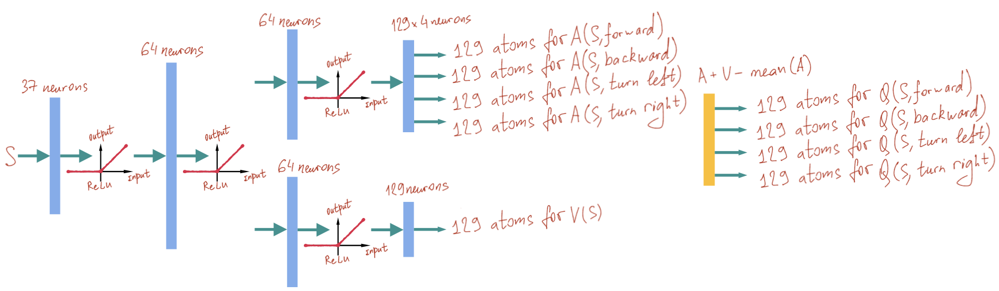
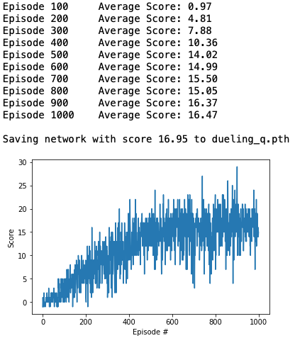

# Project 1: Navigation
### Learning Algorithm

#### Background

Reinforcement Learning studies how to program agents to learn by interacting with their environment: play a computer game or control a self driving car to avoid dynamic obstacles in a dense traffic.

Agents observe their world, perform actions and occasionally receive rewards. However, they do not know which actions in a sequence lead to rewards. In this project, an agent lives in the banana world. It learns how to collect yellow bananas, but to avoid blue bananas without preprogramming of its behavior.

A book _Reinforcement Learning An Introduciton, Second Edition, by Richard S. Sutton and Andrew G. Barto_ provides a great introduction to reinforcement learning algorithms.

In this project, reinforcement learning is implemented via a Q-function. Q-function predicts what a _cumulative_ reward the agent will obtain if the agent performs in a state S an action A:

)

During training, the agent explores the world to learn an approximation of the Q-function. During testing, it exploits the Q-function by choosing the action that corresponds to the maximum Q-value for the given state:

)

_Cumulative_ reward is a sum of rewards that the agent receives when performing a sequence of actions till the end of an episode. Normally, future rewards are _discounted_ with some &lambda; factor, which is between 0 and 1. Let's assume that:

* _t_ is a timestep

* _R<sub>t</sub>_ is an immediate reward at t (in this project, +1 for picking a yellow banana, and -1 for picking a blue banana; the negative reward is a punishment)

* _A<sub>t</sub>_ is an agent action (in this project, it is a direction of motion)

* _S<sub>t</sub>_ is the environment state (in this project, it is ray distances to objects in front of the agent and the agent speed)

then:

%20%3D%20R_t%20%2B%20\lambda%20R_{t%2B1}%20%2B%20\lambda^2%20R_{t%2B2}%20%2B%20\lambda^3%20R_{t%2B3}%20%2B%20...)

The sum propagates until the end of the episode.

Collecting bananas in the envrionment of this project is _episodic_. It means, that after a number of steps when the agent with the environment interaction ends, the agents respawns again in a new version of the banana world and starts collecting rewards from zero again.

The sum above can be written in a recursive form:

%20%3D%20R_t%20%2B%20\lambda%20Q(S_{t%2B1},A_{t%2B1}))

One of the approaches to learn Q-function would be to initialize it with some small positive values, and linearly converge its recursive form at each step t while the agent is exploring the environment, taking actions _A<sub>t</sub>_, observing states _S<sub>t</sub>_ and receiving rewards _R<sub>t</sub>_:

%20\leftarrow%20Q(S_t,A_t)%20%2B%20\alpha%20(R_t%20%2B%20\lambda%20max_a%20Q(S_{t%2B1},a)-%20Q(S_t,A_t)))

&alpha; controls the level of convergence. It is a value between 0.0 and 1.0. And the approach just described is called _Q-learning_.

In order to decide an action while training, the agent may generate a uniform random value between 0 and 1, and if it is less than some &epsilon;, choose a random action; otherwise, choose _argmax<sub>a</sub>Q(S<sub>t</sub>, a)_. The former case is called _exploration_, the latter is _exploitation_. And the overall approach is called an &epsilon;-greedy policy.

If &epsilon; is high, the agent prefers to try new things to explore the environment. If &epsilon; is low, the agent searches for the maximum reward under the current knowledge of its Q-value estimate. In this project, &epsilon; is set 1.0 in the beginning of training and slowly converges to 0.01 by the end. See ```train()``` method in _Navigation.ipynb_ and its ```eps_start``` and ```eps_end``` arguments.

#### Deep Q Learning

In its naive form, Q-function is represented by an array with S and A to be indices of that array. This approach is traditionally taught in books to illustrate how reinforcement learning works for some toy examples. However, in practise, S or A are usually continous and multi-dimensional with infinite amount of values.

In this project, A is a discrete value with one of four possible choices: go forward, go backward, turn left or turn right. However, S is a 37-dimensional float vector, holding the speed of the agent and distances to objects in front of it. Therefore, the array form of Q-function will not work here. Instead, Q-function is approximated by an Artificial Neural Network.

https://www.deeplearningbook.org/ is a good introduction to Deep Learning, studying Artificial Neural Networks. Artificial Neural Network consists of matrix multiplications by weights, stacked in layers, with non-linear transformations between them. In a classical example, a neural network takes pixel values as the input and predicts what type of an object it sees. For example, it can distinguish cats and dogs.

In this project, the neural network predicts the cumulative reward of possible actions for the given state. That is, it represents a Q-function. This approach is called Deep Q Network. In 2013, Deep Mind successfully applied it to learn the agent to play Atari games at a super-human level by using screen pixels as state S and applying joystick commands as actions A. See their seminal paper at http://files.davidqiu.com//research/nature14236.pdf

Instead of applying Q-learning recursive convergence formula, given in the previous example, artificial neural network weights are adjusted using a method, called Stochastic Gradient Descent. &alpha; is replaced with a parameter, called _learningRate_. Stochastic Gradient Descent calculates matrices of partial derivatives of weights with respect to _(R_t + &lambda; max<sub>a</sub> Q(S<sub>t+1</sub>,a) - Q(S<sub>t</sub>,A<sub>t</sub>)))_ error. It then adds this partial derivates multiplied by _learningRate_ to weights to minimize the error whenever the neural network sees _S<sub>t</sub>_ next time to produce cumulative rewards for _A<sub>t</sub>_.

Calculating matrices of partial derivatives for a very big expression is manually infeasible. On the top of that, all of the numeric operations take enormous amount of hardware resources and need parallel computations. Often, they should run on GPU or a specialized hardware. Fortunately, there are libraries that automate partial derivative generation and parallel computations. The most popular are https://www.tensorflow.org/ and https://pytorch.org/

This project uses https://pytorch.org/ version 0.4.0. The neural networks have been trained on CPU and double checked on GPU. Since 37-dimensional state vector is relatively small, CPU resources are enough.

Instead of stochastic gradient descent, my project uses Adam optimizer (see https://arxiv.org/abs/1412.6980). It improves the convergence accuracy and speed of stochastic gradient descent by tuning learning rate dependently on the training results and by applying a number of additional heuristics and methods.

The structure of the most basic implementation of Deep Q Network agent for the banana world is shown in the image below:


It is implemented in ```VanillaQNetwork``` class in _Navigation.ipynb_. The constructor of this class allocates three matrices with weights:
1. ```fc1``` is 37x64 matrix
2. ```fc2``` is 64x64 matrix
3. ```fc3``` is 64x4 matrix

The state _S_ gets multiplied by three matrices sequentially in order to obtain _Q(S, a)_ values (besides matrix weights, there are bias values that are added after each multiplication; but for the simplicity of my explanation, I skip mentioning these details).

Without non-linear operations, three matrix multiplications could have been replaced with a single matrix and my neural network would not have learnt complex things. To prevent this, _ReLU()_ operations follow each but the last matrix multiplication. Each _ReLU(x)_ operation returns x if it is positive, or 0 otherwise. It adds non-linearity to the calculations, allowing neural network to learn complex patterns.

In order to efficiently use neural networks to learn Q-values, Deep Mind in their article proposed the following extensions:

__Replay Buffer__ saves agent experiences as tuples (_S<sub>t</sub>_, _A<sub>t</sub>_, _R<sub>t</sub>_, _S<sub>t+1</sub>_) in memory to be picked randomly later for learning. Neural network converges faster if it receives _uncorrelated_ experiences, i.e. from random non-consecutive time steps. In my project, ```ReplayBuffer``` class implements this functionality, it stores up to 100000 of such tuples in a ```deque```, randomly sampling batches of 64 items to train my neural network

__Q target value__ separates a target neural network from a trained neural network. This helps reduce variance while training, as the target Q-value remains fixed when then trained Q-value approaches it. The training formula turns into:

%20\leftarrow%20Q(S_t,A_t)%20%2B%20\alpha%20(R_t%20%2B%20\lambda%20max_a%20Q'(S_{t%2B1},a)-%20Q(S_t,A_t)))

where _Q'_ is another neural network, which does not participate in training. Occasionally, _Q'_ picks weights from _Q_. In my project, _Q'_ is stored in ```VanillaAgent.qnetwork_target``` field, and Q is ```VanillaAgent.optimizer_local```. ```qnetwork_target``` borrows weight values from ```optimizer_local``` in ```soft_update()``` method using https://en.wikipedia.org/wiki/Exponential_smoothing with ```TAU``` coefficient.

#### Rainbow

Since the original success of Deep Q Network on Atari games, Deep Mind has proposed a number of extensions to Deep Q Networks in their seminal paper https://arxiv.org/pdf/1710.02298.pdf

In my project, I tried to reproduce those extensions. In order to evaluate their impact, I decided to train the agent for 1000 episodes no matter whether it achieves 13.0 scores earlier or not. Then ```train()``` method from _Navigation.ipynb_ saves the best configuration, corresponding to the maximum mean score of 100-episode sliding window.

#### Double Deep Q-Network

https://arxiv.org/abs/1509.06461 proposes the simplest extension: replace _max<sub>a</sub>Q'(S, a)_ with _Q'(S, argmax<sub>a</sub>Q(S, a))_.

Q-learning formula then turns into something like:

%20\leftarrow%20Q(S_t,A_t)%20%2B%20\alpha%20(R_t%20%2B%20\lambda%20Q'(S_{t%2B1},argmax_a%20Q(S_{t%2B1},a))-%20Q(S_t,A_t)))

The idea is that the vanilla approach may overestimate Q-value, biasing the results of training. Two different Q-value estimates balance out each other. This slows down training in the begining, but finally the agent achieves higher scores.

In my project, the extension is implemented in ```DoubleQAgent._calc_loss()``` method. The paper does not state clearly whether _argmax<sub>a</sub>Q(S, a)_ should be treated as a constant or as a variable when calculating derivatives for training. I tried both approaches, and the latter seems to produce more accurate results. Therefore, ```q_local``` is not detached from ```self.qnetwork_local``` in  ```DoubleQAgent._calc_loss()```.

#### Dueling Deep Q-Network

https://arxiv.org/abs/1511.06581 extends the artificial network architecture to meet the specific needs of Q-learning algorithm. In particular, the paper notices that in some states it is important to know the value of the state itself, not the action. Separate estimates of the state value _V(S<sub>t</sub>)_ and the action advantage values _A(S, A<sub>t</sub>)_ allow the neural network to generalize better. Action advantage returns the difference of one action value over the other.

The extension changes the network architecture as shown in the picture below:


The rightmost yellow block is not trained. It calculates _Q(S, a)_ out of _V(S)_ and _A(S, a)_ with the following formula:

%20%3D%20A(S_t,A_t)%20%2B%20V(S_t)%20-%20\frac{1}{4}\sum_{n%3D0}^{3}%20A(S_t,A_n))

The last term in the formula subtracts the average of all advantage actions for the given state _S<sub>t</sub>_. It prevents advantage values from growing infinitely.

The formula is implemented in the end of ```DuelingQNetwork.forward()``` method in _Navigation.ipynb_.

#### Prioritized Replay

https://arxiv.org/abs/1511.05952 describes the way to improve efficiency of the Replay Buffer. Instead of uniform random sampling, prioritize tuples that produce the maximum loss. That is, the probability _P(Experience)_ that the tuple is selected from the memory buffer is proportional to the loss, as shown in the formula below:

%20~%20(R_t%20%2B%20\lambda%20max_a%20Q'(S_{t%2B1},argmax_a%20Q(S_{t%2B1},a))-%20Q(S_t,A_t))^{2*0.6})

where _A<sub>t</sub>_, _S<sub>t</sub>_, _S<sub>t+1</sub>_ and _R<sub>t</sub>_ are taken from the experience tuple.

Loss values are pre-multiplied by _importance sampling_ weights _w<sub>i</sub>_ before propagation to neural network optimization:

})^\beta)

Where _N_ is the number of experience tuples in the replay buffer, &beta; equals 0.4 in the beginning and linearly converges to 1.0 after 100000 training steps. The pioritized replay buffer is implemented in ```PrioritizedReplayBuffer``` class in _Navigation.ipynb_.

All the hyper-parameter values are borrowed from the article. Except that for convenience of integrating distributed q-value in the next section on the top of the prioritized replay agent, I use squares of residuals, not their modules.

#### Distributed Q-Value

Up until ```DistributedQValueAgent```, neural networks in _Navigation.ipynb_ estimated the _expected_ values of Q(S, A), see https://en.wikipedia.org/wiki/Expected_value

However, in some cases, expected values may be misleading. For example, if the probability distribution consists of two peaks, the expected value may be in between, corresponding to 0-probability event.

https://arxiv.org/pdf/1707.06887.pdf suggests expanding the neural network to predict the distribution of Q(S, A) rather than its expected value. The distribution is represented by a histogram with bins, which are called atoms. The picture below shows the network architecture, implemented in ```DistributedDuelingQNetwork``` of _Navigation.ipynb_



In my project, Q-distribution covers the range of cumulative rewards [-32, 32] with evenly distributed 129 atoms. I've experimented with skewed and smaller ranges (e.g. [-5, +20]) and also tried the values from the article (i.e. atoms=51). However, [-32, 32] and atoms=129 produce the best results.

Each atom holds the probability that Q-value lies within its bin. For example, atom<sub>0</sub> holds the probability that _(-32.0 + 64.0 / 130.0) >= Q(S,A) >= -32.0_

#### Noisy Network

Noisy networks add random generators inside their layers, as described in https://arxiv.org/pdf/1706.10295.pdf 

The idea is to substitude &epsilon;-greedy policy, which selects random actions for explorations, with random noise, produced by the network. The amount of random noise is also controlled by trainable parameters. Therefore, neural network decides by itself when it needs exploration and when exploitation, and may potentially explore with more complex and meaningful action sequences than those produced by a uniform random generator.

Noisy networks agent is implemented in ```NoisyDistributedDuelingQNetwork``` class of _Navigation.ipynb_, where network configuraiton is defined in _NoisyDistributedDuelingQNetwork_ class. Two layers of the network, closer to the output are replaced with their noisy counterparts. I tried to make all the layers noisy, however, the network stops learning in this case.

### Plots of Rewards

This section shows trainable plots for different agent configurations. Each agent is trained for 1000 episodes, and the best results, evaluated by the mean 100-episode score window are saved into *.pth files.

In these graphs, Prioritized Replay shows the best results. Distributed Q-Value and  Noisy Network, which are built on the top of Priotized Replay agent, probably need more tuning or more challenging environment to show benefits.

#### Vanilla Deep Q Network


#### Double Deep Q-Network


#### Dueling Deep Q-Network



#### Prioritized Replay


#### Distributed Q-Value


#### Noisy Network


### Ideas for Future Work

* Try Asynchronous Methods for Deep Reinforcement Learning, explained in https://arxiv.org/abs/1602.01783 - this change requires an update of Unity ML Agents library to at least v. 0.9, as mentioned in https://blogs.unity3d.com/ru/2019/11/11/training-your-agents-7-times-faster-with-ml-agents/

* Replace ray-based obstacle detection with pixelwise input, based on convolutional neural networks, see https://en.wikipedia.org/wiki/Convolutional_neural_network and https://pytorch.org/docs/master/generated/torch.nn.Conv2d.html#conv2d

* Try recurrent neural network with LSTM ( https://en.wikipedia.org/wiki/Long_short-term_memory ) and Transformers ( https://en.wikipedia.org/wiki/Transformer_(machine_learning_model) ) to better learn about the hidden state of the world (bananas behind the agent) and avoid Buridan's ass problem, when the agent gets frozen between two choices and does not dare which action to pick

* Try replacing discrete actions with continous commands, like linear and angular velocity, to smoothly pass through bananas

* Try training the agents in a real environment to pick objects or explore the real world. For example, implement a vacuum cleaner robot based on Deep Q Network rather than random actions, heuristics or SLAM
